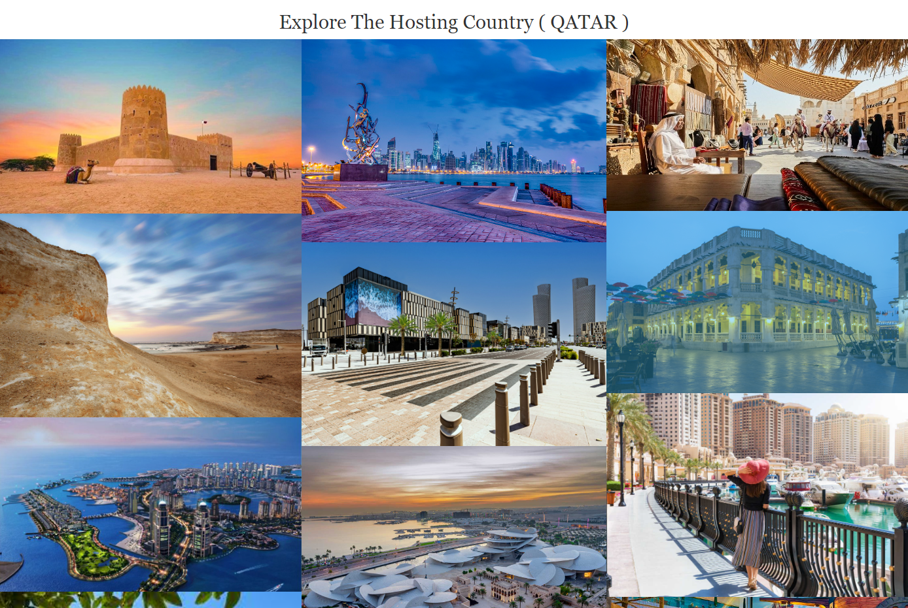

# _World Cup Winner 2022_

---

[World Cup Winner 2022](https://naifzaghmout.github.io/World-Cup-Winner-2022/) it is a website to invite the world to celebrate the football winner team in Qatar 2022 , this website is for all ages who wants to find out about the future football world cup activities and festivals.

---

## Technologies used

- [HTML](https://en.wikipedia.org/wiki/HTML)
- [CSS](https://en.wikipedia.org/wiki/CSS)
- [Font Awesome icons](https://fontawesome.com/v5/search?o=r&m=free)
- [Google fonts](https://fonts.google.com/)

---

## User stories

- As a first time visitor, I want to understand of the website, so I can learn more about the school.
- As a first time visitor, I want to be able to easily navigate through the website, so I can find the information I am looking for.
- As a first time visitor, I want to see the information about the Festival and the city of the event.
- As a first time visitor, I want to see the information about the winner team of the world cup.
- As a person i want to join the event i want the location , time and date of the event.
- As a mobile device user, I want the website to be responsive, so I can use my phone or tablet to visit it.

---

## Features

### Home page

- ##### Navigation

  - Positioned at the top of the page.
  - At the top-center there are navigation links:
    - Home - leads to the home page.
    - Expolre the city - leads to page where it showes images of the city.
    - Event info - leads to the event info , location and date.
  - The navigation is clear and easy to understand for the user.
  - The navigation bar is responsive.

   

   

---

- ##### Head section
  - Head section have an image.
    - It has the name of Fan Zone.

     

---

- ##### Home Page
  - Contains info about the:
   - THE WINNER TEAM [ARGENTINA](https://en.wikipedia.org/wiki/Argentina_national_football_team)

   - ARGENTINA'S MANAGER FOR WORLD CUP [LIONEL-SCALONI'S](https://en.wikipedia.org/wiki/Lionel_Scaloni)

   - ARGENTINA'S BEST PLAYER [Lionel-Messi](https://en.wikipedia.org/wiki/Lionel_Messi)

    

---

- ##### Explore The City Page

  - This sections contains 14 images.
  - The images for the nices places in the city.

  

---

- ##### Event Info Page

  - This section shows the date , time and location for the event.
  - This section contains a map location and Sing Up form.
  

  

---

- ##### Footer

  - Footer contains social media links that open in a new tab.
  - Social media links are animated on hover.

  

---

### Testing

- I tested that the website works in different browsers: Chrome, Firefox, Brave.
- I used devtools and [Am-I-Responsive](https://ui.dev/amiresponsive) to confirm that the website is responsive, looks and functions as it supposed to on all standard screen sizes.
- I tested all the links and confirmed that all of them work and lead where they suppose to lead.

### Bugs

- ##### Solved bugs
 - I was style in css my menu class and the css wasn’t response :

      ul class="menu"
I add the class="menu" to the > nav insted of the > ul
- ##### Unsolved bugs
  - None.

---

### Validator testing

- ##### HTML
  - No errors or warnings were found when passing through the official W3C validator.

  

- ##### CSS
  - No errors or warnings were found when passing through the official W3C (Jigsaw) validator.

  

- ##### Accessibility and performance
  - Using lighthouse in devtools I confirmed that the website is performing well, accessible and colors and fonts chosen are readable.

  

---

### Deployment

- This site was deployed to Github pages, The steps to deploy are as follows:

- In the Github repository , navigate to the Settings tab

- From the source section drop-down menu, select the main Branch

- Once the main branch has been selected , the page provide the link to the website

- Live link: [World-Cup-Winner-2022](https://naifzaghmout.github.io/World-Cup-Winner-2022/)

---

### Credits

- ##### Content
  - The codes for the Form was taken [from W3School](https://w3schools.com/)

  - The information about the winner team was taken from [FIFA](https://www.fifa.com/fifaplus/en)
- ##### Media
  - images was taken from [Google](https://www.google.com/)

  - Google map links was taken from [Google Map](https://www.google.com/maps)

